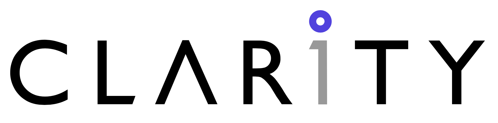

  
# Laravel Essentials Starter Kit 

with Stricter Rules and CLARITY way

## Getting Started  
**Create via Composer:**  
```bash
composer create-project clarity-tech/laravel-essentials-starter-kit  
```

**Create via Laravel CLI:**
```bash
laravel new --using clarity-tech/laravel-essentials-starter-kit  
```

## Introduction
The CLARITY Laravel Starter Kit provides a robust foundation for building Laravel applications with pre-configured packages like Sail, Telescope, and Octane. This project adheres to CLARITY's development standards to ensure consistency and quality across all projects.  

## Features  
- Pre-configured Sail for local development  
- Integrated Telescope for debugging and performance monitoring  
- Octane for high-performance request handling  
- CLARITY-standard directory structure and coding conventions  

## CLARITY Development Standards  
- **Coding Standards:** Follow PSR-12 and CLARITY's internal style guide.  
- **Git Workflow:** Use feature branches and pull requests as outlined in CLARITY's Git workflow documentation.  
- **Testing:** All features require unit and integration tests.  
- **Deployment:** Follow CLARITY's deployment pipeline standards.  

## Contribution Guidelines  
Contributions should align with CLARITY's internal development processes. For more details, refer to our [Internal Contribution Guide](link-to-internal-doc).  

## Support  
For questions or support, visit our [official website](https://www.claritytech.io/) or contact support@claritytech.io.  

## License  
This starter kit is licensed under the MIT license.
